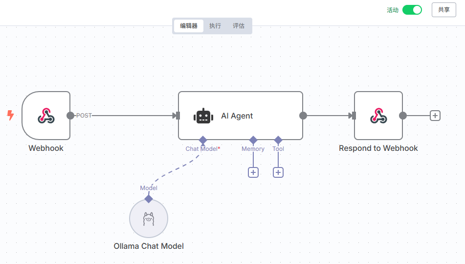
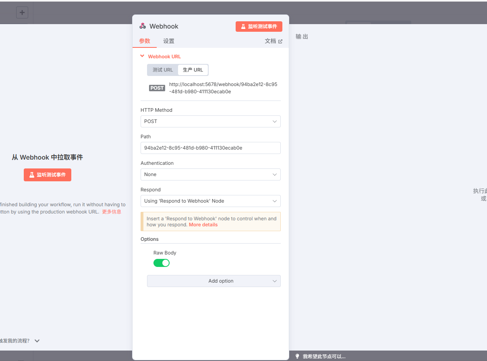

# English version [README_EN.md](README_EN.md)

# 钉钉AI机器人


## 简介
一个基于钉钉流式API的AI聊天机器人，支持接收钉钉群消息并通过n8n Webhook获取AI回复。

## 功能特性

- 🤖 自动接收钉钉群消息
- 🔄 调用n8n Webhook获取AI回复
- 📝 发送格式化的Markdown消息到钉钉群
- 🔐 支持Token缓存和自动刷新
- 📊 完整的日志记录
- ⚡ 异步处理，高性能响应

## 项目结构

```
dingtalk-ai-bot/
├── config.py                 # 配置管理
├── main.py                   # 主程序入口
├── requirements.txt          # 依赖包列表
├── env.example               # 环境变量示例
├── README.md                 # 项目说明
├── utils/                    # 工具模块
│   ├── __init__.py
│   └── token_manager.py      # Token管理器
├── services/                 # 服务模块
│   ├── __init__.py
│   ├── ai_service.py         # AI服务
│   └── dingtalk_service.py   # 钉钉服务
└── handlers/                 # 处理器模块
    ├── __init__.py
    └── chatbot_handler.py    # 聊天机器人处理器
```


## 准备工作

### 4. 获取钉钉应用配置


4. 在机器人管理页面获取 RobotCode
5. 配置机器人权限和回调地址

### 钉钉开放平台准备

#### 1. 创建企业内部钉钉机器人

参考[创建企业内部应用机器人](https://open.dingtalk.com/document/orgapp/the-creation-and-installation-of-the-application-robot-in-the)
创建企业内部钉钉机器人，注意消息接收模式设置为**stream模式**，并且给机器人添加权限，确保机器人可以发送消息。


然后记录该应用的应用ID (client_id) 和 应用密钥 (client_secret)，在机器人管理页面获取 (RobotCode)

#### 2. 创建AI卡片模板

进入钉钉开发者后台[卡片平台](https://open-dev.dingtalk.com/fe/card)
新建一个AI卡片模板，卡片类型选择消息卡片，卡片模板场景选择 AI卡片，并关联上边创建的应用。
然后可以在卡片模板中设置AI卡片的模板


记录该卡片模板的模版ID。

### n8n应用准备

配置 n8n webhook工作流连接




需要选择Webhook触发，并参考下图配置：



n8n 的AI Agent 或者大模型节点，参考下图配置：


n8n 的工作流响应内容请使用Respond to Webhook节点，并参考下图配置：


在完成 n8n 工作流的配置之后，请在其顶部点击Active以启用工作流。


## 快速开始

### 获取代码

```shell
git clone https://github.com/lijian-ui/n8n-on-dingtalk-bot.git

# 有网络问题的可以从gitee镜像仓库拉取
# git clone https://gitee.com/rooky-top/n8n-on-dingtalk-bot.git
```

### 利用Docker启动服务

```shell
cd n8n-on-dingtalk-bot
cp .env.example .env
# 修改.env文件，配置好所需参数。
docker-compose up -d
```

### 从源码启动服务

- python 3.10+


```bash
cd n8n-on-dingtalk-bot
# 最好是在虚拟环境中运行
pip install -r requirements.txt
cp .env.example .env
# 修改.env文件，配置好所需参数。
python main.py
```

### .env配置说明

| 参数 | 说明 | 必填与否  |
|---|---|---|
| DINGTALK_CLIENT_ID  | 钉钉开放平台应用的client_id  | 是  |
| DINGTALK_CLIENT_SECRET  |  钉钉开放平台应用的client_secret | 是  |
| DINGTALK_ROBOT_CODE  | 钉钉开放平台应用机器人的RobotCode  |  是 |
| DINGTALK_AI_CARD_TEMPLATE_ID  | 钉钉AI卡片模板的模版ID，可以在卡片平台中获取，必须使用这个才可以流式输出。  |  是 |
| N8N_WEBHOOK_URL  | n8n工作流的webhook节点的Webhook URL，要使用生产URL  | 是 |
| N8N_API_KEY  | 如果n8nwebhook节点设置了认证就填，非必须  |  否 |
| N8N_WEBHOOK_TIMEOUT  | n8n webhook超时时间（秒），可根据业务调整，如果使用推理模型建议设置30秒以上 | 默认30秒  |
| BOT_NAME  | 机器人名称，用于区分不同的机器人。	  | 否  |
| MAX_MESSAGE_LENGTH  | 限制机器人每次发送到钉钉的消息内容的最大长度，单位是字符数。  | 默认为2000  |
| LOG_LEVEL  | 日志级别  | 默认为INFO  |

 `.env` 文件：

```env
# 钉钉应用配置
# 从 https://open-dev.dingtalk.com 获取
DINGTALK_CLIENT_ID=your_app_key_here
DINGTALK_CLIENT_SECRET=your_app_secret_here
DINGTALK_ROBOT_CODE=your_robot_code_here
DINGTALK_AI_CARD_TEMPLATE_ID=请填写你的钉钉AI卡片模板ID

# n8n Webhook配置
# n8n webhook的URL地址
N8N_WEBHOOK_URL=https://your-n8n-instance.com/webhook/your-webhook-id
N8N_API_KEY=your_n8n_api_key_here
N8N_WEBHOOK_TIMEOUT=30  # n8n webhook超时时间（秒），可根据业务调整

# 机器人配置
BOT_NAME=AI助手

# 限制机器人每次发送到钉钉的消息内容的最大长度，单位是字符数。
MAX_MESSAGE_LENGTH=2000

# 日志配置
LOG_LEVEL=INFO 
```


程序启动后会：
1. 验证配置
2. 连接钉钉流式API
3. 开始监听群消息
4. 自动处理@机器人的消息

## 使用方式

在钉钉群中@机器人并发送消息，机器人会：

1. 接收您的消息
2. 调用n8n Webhook获取AI回复
3. 以Markdown格式流式输出回复到群中


## 故障排除

### 常见问题

1. **配置错误**
   - 检查 `.env` 文件中的配置是否正确
   - 确保钉钉应用权限配置正确

2. **Token获取失败**
   - 检查 AppKey 和 AppSecret 是否正确
   - 确认网络连接正常

3. **AI回复失败**
   - 检查 n8n Webhook URL 是否正确
   - 确认 n8n 工作流正常运行
   - 查看日志中的错误信息

4. **消息发送失败**
   - 检查 RobotCode 是否正确
   - 确认机器人已添加到群中
   - 验证机器人权限设置

### 调试模式

设置日志级别为 DEBUG 获取更详细的信息：

```env
LOG_LEVEL=DEBUG
```

## 开发

### 添加新的消息类型

在 `services/dingtalk_service.py` 中添加新的消息发送方法。

### 自定义AI响应处理

在 `services/ai_service.py` 中修改 `_parse_ai_response` 方法以适应不同的n8n响应格式。

### 扩展功能
以下为计划中的扩展功能，欢迎贡献
- 支持图片、文件等多媒体消息
- 添加用户权限控制
- 实现消息历史记录
- 添加管理命令

## 许可证

MIT License

## 贡献

欢迎提交 Issue 和 Pull Request！ 