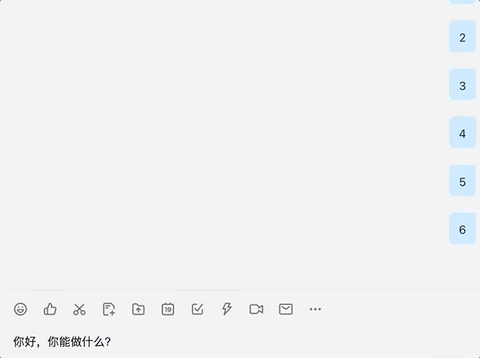
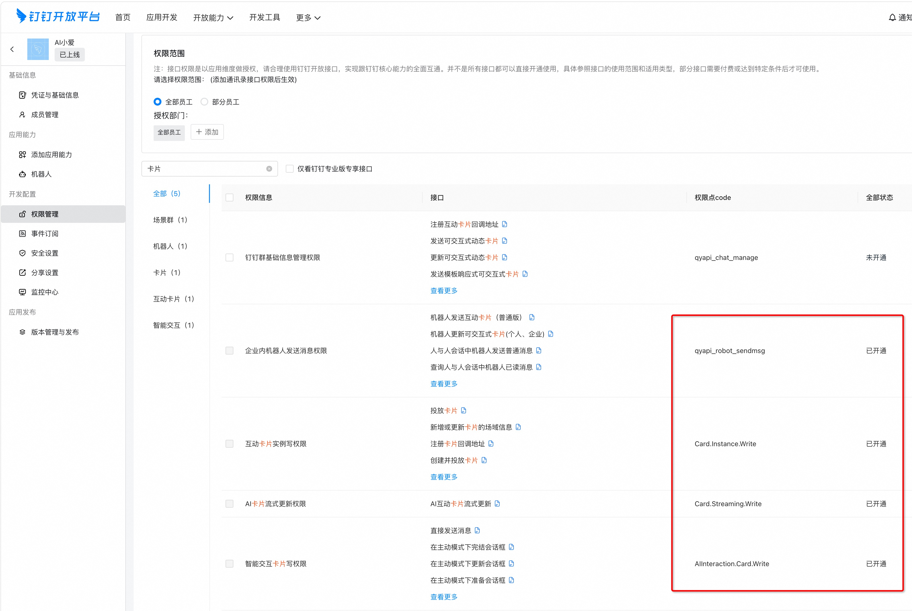

# DingTalk AI Bot



## Introduction
A DingTalk AI chatbot based on DingTalk streaming API, supports receiving DingTalk group messages and getting AI replies via n8n Webhook.

## Features

- 🤖 Automatically receive DingTalk group messages
- 🔄 Call n8n Webhook to get AI replies
- 📝 Send formatted Markdown messages to DingTalk group
- 🔐 Support token caching and auto-refresh
- 📊 Complete logging
- ⚡ Asynchronous processing, high performance

## Project Structure

```
dingtalk-ai-bot/
├── config.py                 # Configuration management
├── main.py                   # Main entry
├── requirements.txt          # Dependencies
├── env.example               # Environment variable example
├── README.md                 # Project documentation
├── utils/                    # Utility modules
│   ├── __init__.py
│   └── token_manager.py      # Token manager
├── services/                 # Service modules
│   ├── __init__.py
│   ├── ai_service.py         # AI service
│   └── dingtalk_service.py   # DingTalk service
└── handlers/                 # Handler modules
    ├── __init__.py
    └── chatbot_handler.py    # Chatbot handler
```

## Preparation

### 1. Obtain DingTalk App Configuration

4. Get RobotCode on the bot management page
5. Configure bot permissions and callback address

### DingTalk Open Platform Preparation

#### 1. Create an Internal DingTalk Bot

Refer to [Create an internal application bot](https://open.dingtalk.com/document/orgapp/the-creation-and-installation-of-the-application-robot-in-the)
Create an internal DingTalk bot, set the message receiving mode to **stream mode**, and add permissions to ensure the bot can send messages.



Then record the App ID (client_id) and App Secret (client_secret) of the application, and get the RobotCode on the bot management page.

#### 2. Create AI Card Template

Go to DingTalk developer backend [Card Platform](https://open-dev.dingtalk.com/fe/card)
Create a new AI card template, select message card as the card type, select AI card as the card template scenario, and associate it with the application created above.
You can then set the AI card template in the card template.


Record the template ID of the card template.

### n8n Application Preparation

Configure n8n webhook workflow connection


Select Webhook trigger and configure as shown below:


n8n AI Agent or LLM node, configure as shown below:


The workflow response content of n8n should use the Respond to Webhook node, configure as shown below:


After completing the n8n workflow configuration, click Active at the top to enable the workflow.

## Quick Start

### Get the Code

```shell
git clone https://github.com/lijian-ui/n8n-on-dingtalk-bot.git

# If you have network issues, you can pull from the Gitee mirror
# git clone https://gitee.com/rooky-top/n8n-on-dingtalk-bot.git
```

### Start Service with Docker

```shell
cd n8n-on-dingtalk-bot
cp .env.example .env
# Edit the .env file and configure the required parameters.
docker-compose up -d
```

### Start Service from Source

- python 3.10+

```bash
cd n8n-on-dingtalk-bot
# It is recommended to run in a virtual environment
pip install -r requirements.txt
cp .env.example .env
# Edit the .env file and configure the required parameters.
python main.py
```

### .env Configuration Description

| Parameter | Description | Required |
|---|---|---|
| DINGTALK_CLIENT_ID  | DingTalk Open Platform App client_id  | Yes  |
| DINGTALK_CLIENT_SECRET  |  DingTalk Open Platform App client_secret | Yes  |
| DINGTALK_ROBOT_CODE  | RobotCode of the DingTalk Open Platform App bot  |  Yes |
| DINGTALK_AI_CARD_TEMPLATE_ID  | AI card template ID, can be obtained from the card platform, required for streaming output.  |  Yes |
| N8N_WEBHOOK_URL  | Webhook URL of the n8n workflow node, use the production URL  | Yes |
| N8N_API_KEY  | Fill in if the n8n webhook node is authenticated, not required  |  No |
| N8N_WEBHOOK_TIMEOUT  | n8n webhook timeout (seconds), can be adjusted according to business, if using inference model, set to 30 seconds or more | Default 30s  |
| BOT_NAME  | Bot name, used to distinguish different bots.  | No  |
| MAX_MESSAGE_LENGTH  | Limit the maximum length of each message sent to DingTalk, in characters.  | Default 2000  |
| LOG_LEVEL  | Log level  | Default INFO  |

 `.env` file:

```env
# DingTalk App configuration
# Get from https://open-dev.dingtalk.com
DINGTALK_CLIENT_ID=your_app_key_here
DINGTALK_CLIENT_SECRET=your_app_secret_here
DINGTALK_ROBOT_CODE=your_robot_code_here
DINGTALK_AI_CARD_TEMPLATE_ID=your_dingtalk_ai_card_template_id

# n8n Webhook configuration
# n8n webhook URL
N8N_WEBHOOK_URL=https://your-n8n-instance.com/webhook/your-webhook-id
N8N_API_KEY=your_n8n_api_key_here
N8N_WEBHOOK_TIMEOUT=30  # n8n webhook timeout (seconds), can be adjusted

# Bot configuration
BOT_NAME=AI Assistant

# Limit the maximum length of each message sent to DingTalk, in characters.
MAX_MESSAGE_LENGTH=2000

# Log configuration
LOG_LEVEL=INFO 
```

After the program starts, it will:
1. Validate configuration
2. Connect to DingTalk streaming API
3. Start listening to group messages
4. Automatically handle @bot messages

## Usage

@ the bot in the DingTalk group and send a message, the bot will:

1. Receive your message
2. Call n8n Webhook to get AI reply
3. Stream the reply to the group in Markdown format

## Troubleshooting

### Common Issues

1. **Configuration error**
   - Check if the `.env` file configuration is correct
   - Ensure DingTalk app permission configuration is correct

2. **Token acquisition failed**
   - Check if AppKey and AppSecret are correct
   - Ensure network connection is normal

3. **AI reply failed**
   - Check if n8n Webhook URL is correct
   - Ensure n8n workflow is running normally
   - Check error messages in the log

4. **Message sending failed**
   - Check if RobotCode is correct
   - Ensure the bot has been added to the group
   - Verify bot permission settings

### Debug Mode

Set log level to DEBUG for more detailed information:

```env
LOG_LEVEL=DEBUG
```

## Development

### Add New Message Types

Add new message sending methods in `services/dingtalk_service.py`.

### Customize AI Response Processing

Modify the `_parse_ai_response` method in `services/ai_service.py` to adapt to different n8n response formats.

### Planned Features
The following are planned features, contributions are welcome:
- Support for images, files and other multimedia messages
- Add user permission control
- Implement message history
- Add management commands

## License

MIT License

## Contribution

Welcome to submit Issues and Pull Requests! 